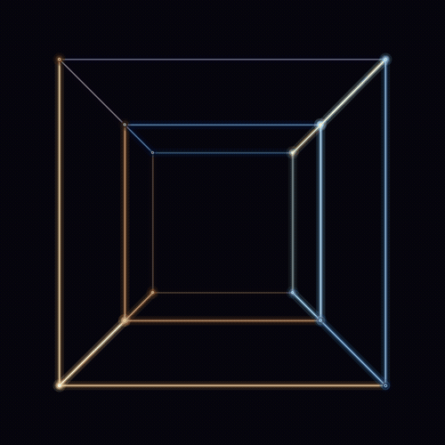

<p align="center">
  
</p>

<h1 align="center">hypercube 4D</h1>

<p align="center">
  <em>tesseract — 16 vertices, 32 edges — 4D → 3D → 2D projection. made at 4am because i was bored and wanted to learn.</em>
</p>

---

This is a learning project. I lost the original GLSL version (was a driftwm wallpaper on another OS, never pushed to git) and didn't want to rewrite it from zero in shader code again — so I remade it in **Java Swing** instead. No libraries, no Processing, just `javac` + `java`.

Why? Boredom + curiosity about 4D. No deeper reason. If you want to understand how a tesseract actually moves, you have to build one.

### How it works

- 16 vertices of `[-1,1]^4`, 32 edges (vertices differing by 1 bit)
- Simultaneous rotation in 4D: `XW * YW * ZW * XY` at `t*0.7 / 0.5 / 0.3 / 0.4`
- Perspective projection `4D → 3D (d=5)` → `2D (d=5)` — stable, no blow-up at `w ≈ -5`
- Depth-sorted edges, palette `0.5 + 0.5*cos(2π*(hue+offset))`, 3-pass glow (outer 14px / inner 6px / core 1.8px) + haloed vertices

### Files

| file | notes |
|---|---|
| `Hypercube.java` | main — Swing, ~60fps, zero deps |
| `hypercube-400.gif` | 2.6MB — use this in README / GitHub |
| `hypercube-500.gif` | 4.1MB — higher quality |
| `hypercube.gif` | 11MB — 700px original (wallpaper, not for repo) |
| `hypercube.glsl` | shader version — GLSL ES 100, for [The Book of Shaders](https://thebookofshaders.com/edit.php) |
| `hypercube.mp4` | 1.3MB loop for driftwm / wallpaper |

### Run

From repo root:
```bash
javac hypercube/Hypercube.java -d hypercube && java -cp hypercube Hypercube
```
Inside `hypercube/`:
```bash
javac Hypercube.java && java Hypercube
```

- **drag** → scrub time
- **click** → pause / resume

### Shader

Paste `hypercube.glsl` into https://thebookofshaders.com/edit.php — uniforms `u_time` and `u_resolution` are already declared.

---

<p align="center">
  <sub>built for learning and boredom. if you're here at 4am too, it worked.</sub>
</p>
